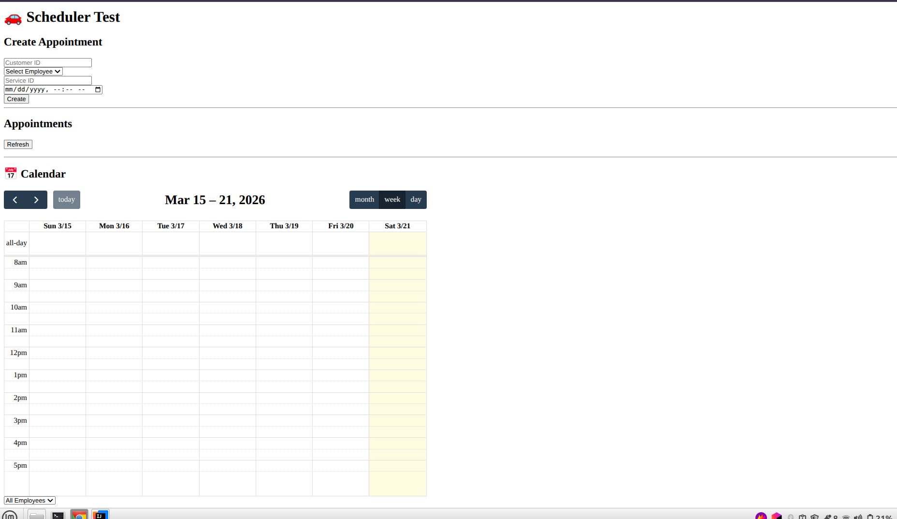
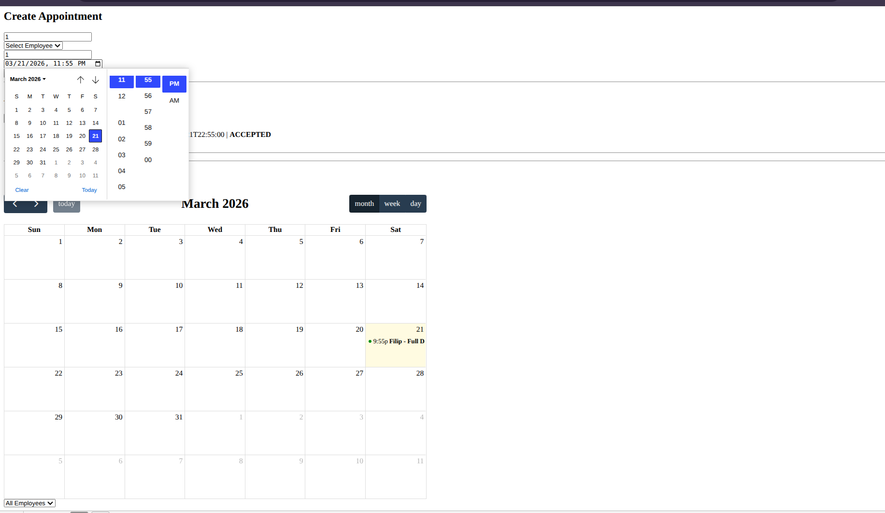

# 🚗 Schedulero - Car Detailing Scheduler

Schedulero is a web-based application designed to streamline appointment scheduling and management for car detailing businesses. It enables efficient organization of customers, services, and employee assignments in a structured and user-friendly system.

---

## 🚀 Features

- 📅 Create and manage appointments
- 👨‍🔧 Assign employees to services
- 🔍 Filter appointments by employee
- 🧾 Manage customers and detailing services
- 🌐 RESTful backend with Spring Boot

---

## 🛠 Tech Stack

- **Backend:** Java, Spring Boot
- **Build Tool:** Maven
- **Frontend:** HTML, JavaScript (Thymeleaf if you're using it)
- **Database:** H2 / MySQL

---

## 📂 Project Structure
src/
├── main/
│ ├── java/... (controllers, services, repositories, models, exceptions, enums)
│ └── resources/
│ ├── templates/
│ ├── static/
│ └── application.properties

Web layer, repository layer, service layer established.
Simple hmtl with javascript established for testing.

📈 Development Milestones
✅ v0.1 - Project Setup
Initialized Spring Boot application
Configured project structure
Added core entities

✅ v0.2 - Core Functionality
Appointment creation implemented
Employee and service management
Backend API endpoints

🔧 v0.3 - In Progress
Fix employee filtering issue in UI
Improve filtering functionality
Enhance frontend interaction (visual calendar and clock)

## 📸 Screenshots

