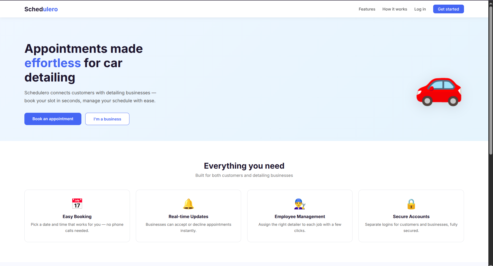
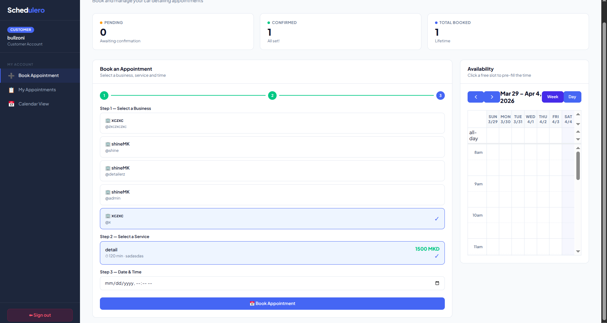
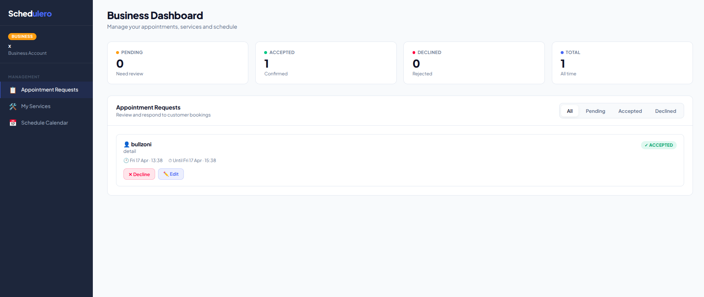
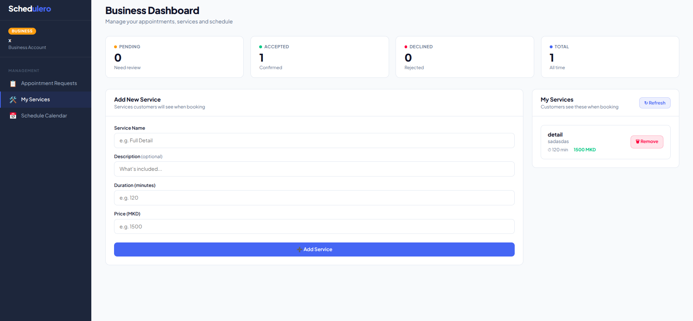
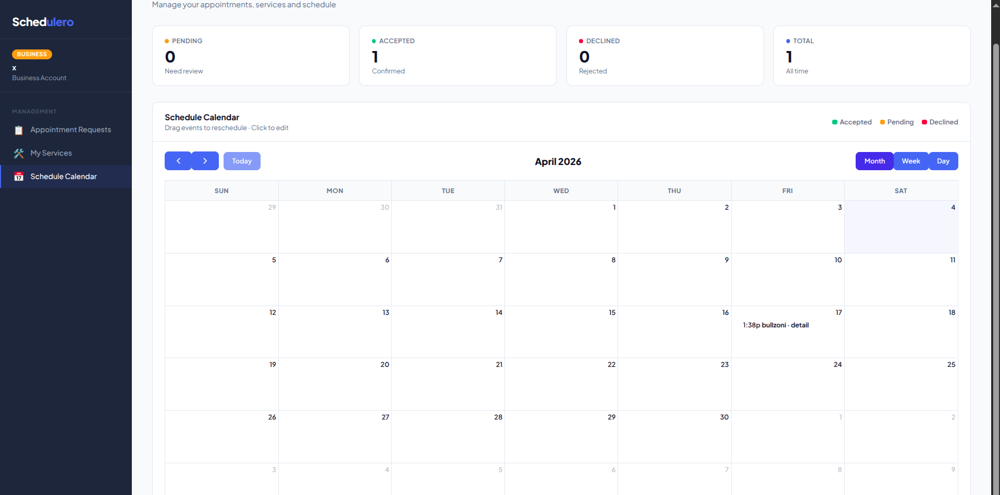

# 🚗 Schedulero — Car Detailing Appointment Platform

Schedulero is a full-stack web application that streamlines appointment scheduling for car detailing businesses. Customers can register, browse businesses, select services, and book appointments. Business owners can manage their service catalog and respond to booking requests — all through a clean, professional dashboard.

---

## 🚀 Features

### 👤 Customer Side
- Register and log in as a customer
- Browse registered detailing businesses
- View each business's services with prices and duration
- Book appointments in a guided 3-step flow (Business → Service → Date/Time)
- Track appointment status (Pending, Confirmed, Declined)
- View appointments in a calendar

### 🏢 Business Side
- Register and log in as a business
- Add and manage your service catalog (name, description, duration, price in MKD)
- View all incoming appointment requests
- Accept, decline, or reschedule appointments
- Drag-and-drop calendar for schedule management
- Dashboard stats (pending, accepted, declined, total)

### 🔐 Authentication & Security
- Spring Security with session-based authentication
- Separate roles: `ROLE_USER` and `ROLE_BUSINESS`
- Role-based redirect after login
- BCrypt password hashing
- CSRF protection (exempted for REST API calls)

---

## 🛠 Tech Stack

| Layer | Technology |
|---|---|
| Backend | Java 17, Spring Boot 3.2.1 |
| Security | Spring Security 6 |
| ORM | Spring Data JPA / Hibernate |
| Database | PostgreSQL |
| Frontend | Thymeleaf, HTML, CSS, JavaScript |
| Calendar | FullCalendar 6.1.11 |
| Build Tool | Maven |
| Fonts | Plus Jakarta Sans (Google Fonts) |

---

## 📂 Project Structure

```
src/
├── main/
│   ├── java/mk/ukim/finki/wp/schedulero/
│   │   ├── config/          # SecurityConfig, DataInitializer
│   │   ├── controller/      # AuthController
│   │   ├── dto/             # CreateAppointmentDto, DisplayAppointmentDto
│   │   ├── enums/           # AppointmentStatus, UserRole
│   │   ├── exceptions/      # InvalidAppointmentException
│   │   ├── model/           # AppUser, Customer, Appointment, DetailService, Business
│   │   ├── repository/      # JPA repositories
│   │   ├── service/         # AppointmentService, AuthService, CustomUserDetailsService
│   │   └── web/             # AppointmentController, BusinessController, ServiceController
│   └── resources/
│       ├── templates/
│       │   ├── index.html        # Public landing page
│       │   ├── dashboard.html    # Role-aware app dashboard
│       │   └── auth/
│       │       ├── login.html
│       │       └── register.html
│       └── application.properties
```

---

## ⚙️ Setup & Running Locally

### Prerequisites
- Java 17+
- Maven
- PostgreSQL

### 1. Create the database
```bash
sudo -u postgres psql
CREATE DATABASE schedulero;
\q
```

### 2. Configure `application.properties`
```properties
spring.datasource.url=jdbc:postgresql://localhost:5432/schedulero
spring.datasource.username=postgres
spring.datasource.password=yourpassword
spring.jpa.hibernate.ddl-auto=update
```

### 3. Run the application
```bash
./mvnw spring-boot:run
```

### 4. Open in browser
```
http://localhost:8080
```

---

## 📈 Development Milestones

### ✅ v0.1 — Project Setup
- Initialized Spring Boot application
- Configured project structure
- Added core entities

### ✅ v0.2 — Core Functionality
- Appointment creation implemented
- Backend API endpoints
- Basic HTML test page with FullCalendar

### ✅ v0.3 — Authentication & PostgreSQL
- Spring Security integration with role-based access
- Separate USER and BUSINESS roles
- Migrated from H2 to PostgreSQL
- BCrypt password hashing
- Auto-creates Customer profile on user registration

### ✅ v0.4 — Professional UI
- Landing page with hero section, features, how-it-works, CTA
- Login and Register pages with tabbed user/business forms
- Role-aware dashboard with sidebar navigation
- Toast notifications replacing browser alerts
- FullCalendar integration with styled events

### ✅ v0.5 — Business & Service Management
- Businesses can add services with name, description, duration and price
- Services are tied to a specific business
- Customers select a business, then see only that business's services with prices
- 3-step guided booking flow with visual step indicator
- Business dashboard shows appointment requests with accept/decline/edit
- Drag-and-drop rescheduling on calendar

---

## 📸 Screenshots

### Landing Page


### User Dashboard


### Business Dashboard


### Add a Detail


### Updated Calendar


---

## 👤 Author

Filip Stankovski — [github.com/filipstankovski](https://github.com/filipstankovski)
